# -vida-sana
## práctica para saber usar GitHub

# 📄 Datos Generales

## integrantes
integrante 1
- **Nombre completo:** Carvajal Bustillos Gael Alan  
- **Edad:** 17  
- **Correo electrónico:** 23308060610312@cetis61.edu.mx  
- **Especialidad:** Programación  
- **Institución:** CETis 61  

integrante 2
- **Nombre completo:** Mireles Mendez Yesenia 
- **Edad:** 17  
- **Correo electrónico:** 23308060610600@cetis61.edu.mx
- **Especialidad:** Programación  
- **Institución:** CETis 61

# ANÁLISIS DE MERCADO Y ENCUESTA PARA APLICACIÓN NUTRICIONAL

## 1. Introducción
El presente proyecto tiene como propósito analizar el mercado actual de aplicaciones nutricionales y recopilar información directa de usuarios potenciales para identificar oportunidades de mejora e innovación.  
A partir de los resultados, se propone el desarrollo de una aplicación o sitio web llamado **“Vida Sana”**, enfocado en promover una alimentación equilibrada y consciente.

El sitio **“Vida Sana”** busca informar, orientar y educar a los usuarios sobre la importancia de mantener una dieta saludable para mejorar la calidad de vida y prevenir enfermedades relacionadas con la mala nutrición.  
Será un espacio confiable y atractivo para estudiantes, jóvenes y familias, donde podrán encontrar información clara, consejos prácticos, videos educativos y recetas nutritivas fáciles de preparar.  
De esta manera, se pretende motivar a los usuarios a aplicar los conocimientos adquiridos en su vida cotidiana, fomentando una cultura de bienestar y autocuidado.

## 2. Objetivos de la investigación

### Objetivo general
Realizar un análisis completo de aplicaciones nutricionales existentes y recopilar datos de usuarios potenciales mediante una encuesta, con el fin de identificar las funcionalidades más valoradas y proponer mejoras para el desarrollo del sitio **“Vida Sana”**.

### Objetivos específicos
- Analizar tres aplicaciones de nutrición destacadas, evaluando sus características, ventajas, desventajas y experiencia de usuario.  
- Identificar las necesidades y preferencias de los usuarios mediante una encuesta estructurada.  
- Establecer criterios para el diseño de una aplicación nutricional educativa, práctica y accesible.  
- Proponer oportunidades de mejora basadas en los hallazgos obtenidos.

## 3. Metodología utilizada
La investigación se divide en dos partes principales:

### Parte 1: Análisis de aplicaciones existentes
Se seleccionaron tres aplicaciones representativas del mercado (por ejemplo: **MyFitnessPal**, **Yazio** y **Cronometer**).  
Para cada una se analizarán los siguientes aspectos:
- Funcionalidades principales (registro de alimentos, planes de dieta, seguimiento de nutrientes, base de datos, etc.)  
- Experiencia de usuario (interfaz, facilidad de uso, diseño visual)  
- Modelo de negocio (gratuita, freemium o de pago)  
- Puntos fuertes y débiles  
- Características innovadoras  

### Parte 2: Diseño y aplicación de encuesta
Se elaboró una encuesta de mínimo 15 preguntas (mezclando abiertas y cerradas) con el objetivo de conocer:
- Perfil de los usuarios potenciales (edad, objetivos, experiencia con apps de nutrición)  
- Funcionalidades más valoradas  
- Problemas comunes con apps existentes  
- Preferencias de diseño y usabilidad  

Cada integrante aplicará la encuesta a por lo menos 15 personas.  
Los resultados serán analizados mediante gráficos y tablas comparativas para obtener conclusiones claras.

## 4. Análisis de Aplicaciones Existentes
Se evaluaron tres aplicaciones principales del mercado con base en los criterios mencionados.  
Cada análisis incluyó descripción general, características destacadas, ventajas, desventajas y capturas de pantalla de apoyo.

| Aplicación | Funcionalidades principales | Experiencia de usuario | Modelo de negocio | Puntos fuertes | Puntos débiles | Características innovadoras |
|-------------|-----------------------------|------------------------|------------------|----------------|----------------|------------------------------|
| **MyFitnessPal** | Registro de alimentos, contador de calorías, base de datos amplia | Interfaz clara y moderna | Freemium | Gran comunidad, sincronización con dispositivos | Publicidad en versión gratuita | Escaneo de códigos de barras |
| **Yazio** | Planes personalizados, recetas saludables, registro de progreso | Fácil de usar, diseño visual atractivo | Freemium | Enfoque en objetivos (bajar peso, ganar masa) | Algunas funciones bloqueadas | Integración con smartwatch |
| **Cronometer** | Seguimiento detallado de nutrientes y micronutrientes | Interfaz más técnica | Freemium / Pago | Precisión y nivel profesional | Complejidad para principiantes | Reportes detallados nutricionales |

## 5. Diseño y Resultados de Encuesta

### Diseño de la encuesta
La encuesta se elaboró en Google Forms con preguntas mixtas.  
Se justificó su aplicación para identificar las preferencias del público objetivo (principalmente jóvenes y familias interesadas en mejorar sus hábitos alimenticios).  
Las preguntas abordaron temas como hábitos actuales, uso de apps de nutrición, problemas comunes y expectativas de diseño.

### Resultados esperados
Se esperaba obtener información sobre las funcionalidades más valoradas (como el registro fácil de alimentos, recomendaciones personalizadas y recetas sencillas), así como los principales problemas que enfrentan los usuarios (interfaz complicada, datos inexactos o exceso de publicidad).  
Los resultados se presentaron mediante gráficos y un análisis interpretativo.

---

## 📊 Gráficas de la Encuesta

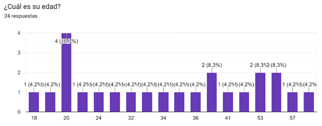
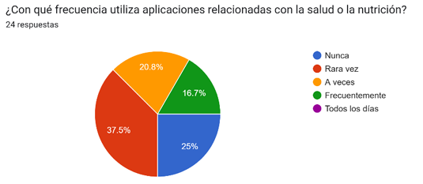
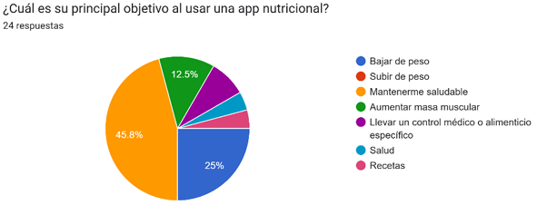
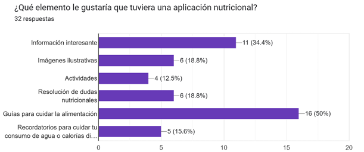
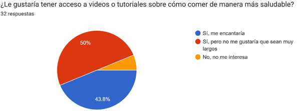
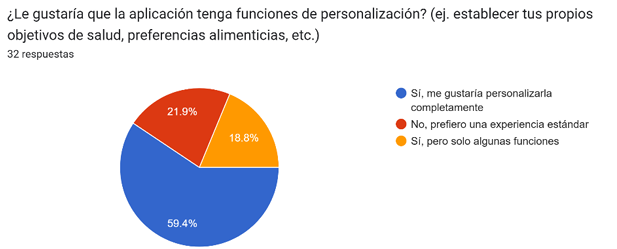
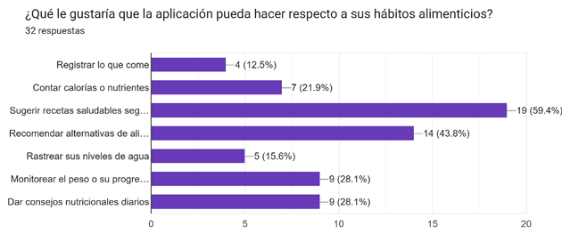
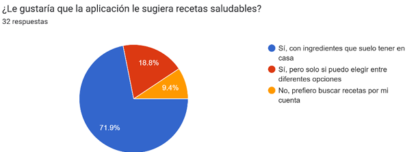
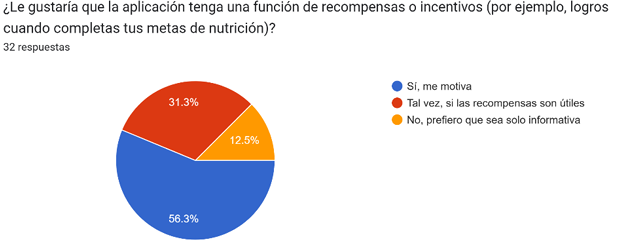
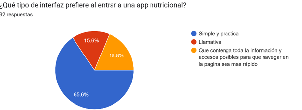
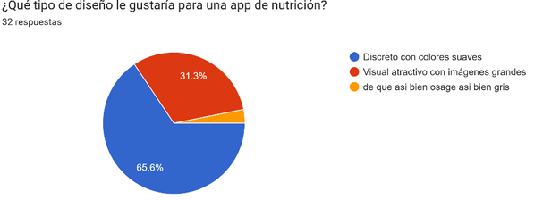
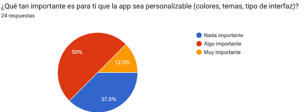

## ¿Qué tipo de funciones innovadoras o diferentes le gustaría ver en una app de nutrición?

**24 respuestas**

- Simples  
- Personalización de recetas con mis ingredientes disponibles  
- Tutoriales de alimentos  
- Con música  
- Escáner de alimento  
- Fáciles e ilustrativas  
- Videos de recetas  
- No sé  
- Un sistema que monitoree mis cantidades de agua consumida  
- Mida grasa visceral  
- Una imagen de cómo va el progreso  
- Prácticas  
- Un menú práctico  
- Recetas  
- Que lleguen notificaciones informando progresos y frases motivadoras  
- Un RPG táctico por turnos  
- Decirle a la app cuántos vasos de agua he tomado y que me diga cuántos me faltan  
- Sistema de recompensas  
- Que incluya menú para niños y adultos  
- Que te den ánimo  
- Comparaciones mensuales sobre los avances  
- Que cada receta muestre sus beneficios  
- Expertos hablando del tema  
- Fácil de entender  

## Si pudieras diseñar una función “perfecta” para ti, ¿cómo sería?

**24 respuestas**

- No sé  
- Simple y entendible  
- Que se pueda usar sin Internet  
- Atractiva  
- Para poder llevar un control de tus metas físicas  
- Que dé recordatorios  
- Sencilla de usar y práctica  
- Que analice hábitos alimenticios  
- Que sea gratuita  
- Práctica, fácil de usar  
- Sencilla, sin tanto color  
- Simple  
- Opciones prácticas  
- Personalización  
- Actividades dinámicas para motivar  
- Un RPG táctico por turnos  
- Que dé logros según los objetivos cumplidos  
- Que recompense por cada objetivo alcanzado  
- Recetas fáciles y rápidas  
- Crear un avatar basado en altura y peso que cambie con el progreso  
- Que cuente las calorías  
- En videos  
- Fácil y rápida  

## ¿Cuál ha sido tu peor experiencia con una app de nutrición?

**24 respuestas**

- Nunca la he usado  
- Anuncios invasivos  
- No he tenido  
- Lentas  
- Que no son gratuitas  
- Nunca he usado una  
- Información no confiable  
- Que sea de paga  
- Ofrecer diagnóstico o menú solo tras pagar  
- Muy lenta y pesada  
- Muy complicada  
- Textos muy largos  
- Ninguna  
- Datos incorrectos que causan estrés  
- Falta de modo RPG táctico  
- Que sea de paga (repetido por varios usuarios)  
- Ingredientes no disponibles en su país  
- Metas o instrucciones poco realistas  
- Poco entendible  

## ¿Qué aspecto consideras que las apps actuales no logran cubrir bien?

**24 respuestas**

- Personalización  
- Solo funcionan con conexión a Internet  
- No muestran lo negativo de los alimentos  
- Todo bien  
- No planean la alimentación según el estilo de vida  
- No consideran alergias  
- Demasiadas microtransacciones y anuncios  
- Falta de programas personalizados  
- Recetas con ingredientes muy caros  
- Falta de practicidad  
- Demasiada complejidad  
- Información incierta o sin respaldo de nutricionistas  
- No tienen un RPG táctico por turnos  
- Pocas funciones útiles  
- Muchas microtransacciones o anuncios  
- No incluyen a toda la familia  
- Ingredientes poco accesibles  
- Planes alimenticios demasiado específicos  
- No explican beneficios de los ingredientes  
- Exceso de anuncios  
- Falta de rapidez y simplicidad  

## 6. Conclusiones y Oportunidades
El análisis del mercado y las encuestas permitieron comprender mejor las necesidades reales de los usuarios y detectar áreas de mejora en las aplicaciones existentes.  
Entre las oportunidades principales destacan:

- Crear una app educativa con enfoque en la comprensión de la nutrición, no solo en el conteo de calorías.  
- Ofrecer contenido práctico (recetas, videos, consejos) adaptado al estilo de vida de los jóvenes y familias.  
- Desarrollar una interfaz limpia, atractiva y fácil de usar desde cualquier dispositivo.

En síntesis, el proyecto **“Vida Sana”** representa una oportunidad para combinar tecnología, educación y salud en una herramienta accesible, útil y moderna que promueva la nutrición consciente y el bienestar integral.
